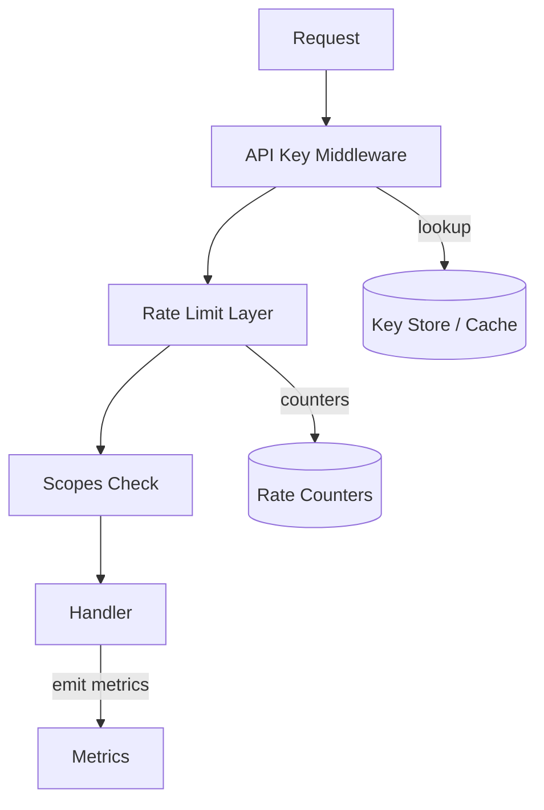

# Authentication & Rate Limiting Enhancements Design

artifact_id: c6f45d23-5f0e-4c1e-9a14-2fda7a849b32

## Overview

Introduce scoped API keys, daily quota tracking, layered rate limiting (key, IP, global backpressure), abuse heuristics, and operational tooling. Maintain small, testable modules with pluggable storage for future distributed cache (Redis).

## Architecture



## Data Model (Postgres)

```sql
CREATE TABLE api_keys (
  id uuid PRIMARY KEY,
  prefix text NOT NULL UNIQUE,
  hashed_secret text NOT NULL,
  scopes text[] NOT NULL,
  daily_quota int NULL,
  daily_usage int NOT NULL DEFAULT 0,
  last_used_at timestamptz NULL,
  revoked boolean NOT NULL DEFAULT false,
  created_at timestamptz NOT NULL DEFAULT now()
);
CREATE INDEX ON api_keys (revoked);
```

Prefix: first 10 chars of uuid (or random) for audit reference.

## Key Format & Parsing

`ck_<prefix>_<secret>`: split by `_`. Validate length & charset. Hash secret using Bun.password.hash (argon2id) or bcrypt. Compare via Bun.password.verify.

## Key Cache

In-memory Map<string,payload> with TTL (KEY_CACHE_TTL_MS). Each entry: { scopes, dailyQuota, dailyUsage, revoked, lastSyncAt }.
Eviction: LRU or size-limited (MAX_KEY_CACHE=10k). On revoked flag update, optional bump KEY_CACHE_EPOCH env variable to flush (checked each request cheaply).

## Scope Enforcement

Mapping:

-   POST /api/jobs -> jobs:create
-   GET /api/jobs/:id -> jobs:read
-   GET /api/jobs/:id/result -> results:read
-   POST /api/uploads/sign -> uploads:sign
-   GET /metrics -> metrics:read (optional, maybe unauth for internal)
    If scope missing -> 403 SCOPE_FORBIDDEN.

## Daily Quota Tracking

On job creation success increment daily_usage (atomic UPDATE returning). Reset strategy: cron job at UTC midnight sets daily_usage=0 where daily_quota IS NOT NULL.
Alternative: store usage_day (date) and reset when changes. Chosen: usage_day column.

```sql
ALTER TABLE api_keys ADD COLUMN usage_day date NULL;
```

If usage_day != current_date then set daily_usage=1, usage_day=current_date else daily_usage+1. If daily_usage exceeds daily_quota -> reject and revert increment.

## Rate Limiting Algorithms

### Token Bucket (In-Memory)

Structure: { lastRefillTs, tokens }. Refill = (now-lastRefill)\*ratePerSec added (capped at capacity).
Config env:

-   KEY_BUCKET_CAPACITY (default 30)
-   KEY_BUCKET_REFILL_PER_SEC (default 0.5)
-   IP_BUCKET_CAPACITY (default 15)
-   IP_BUCKET_REFILL_PER_SEC (default 0.25)
    Return 429 RATE_LIMITED when empty.
    Metrics: auth.rate_limit_hits_total{type=key/ip}.

### Global Backpressure

Check queue depth & worker utilization passed via shared metrics snapshot provider. If queueDepth > QUEUE_HIGH_WATERMARK AND utilization > UTIL_THRESHOLD then return 503 OVERLOADED (or 429 BACKPRESSURE) with Retry-After header (short, e.g., 5s).

## Abuse Detection

Heuristics:

-   validation_failures[key] rolling window 1m > VALIDATION_FAIL_THRESHOLD -> cooldown (COOLDOWN) for key for COOLDOWN_SEC.
-   not_found_status_polls[ip] > threshold -> soft block (shadow log first). After grace escalate to limited results (404 but counted).
    Implementation: ring buffer counters per identity with pruning.

## Middleware Flow

1. Extract correlationId.
2. Parse API key if present. If required and missing -> 401.
3. Lookup key in cache -> if miss, fetch from DB -> populate cache.
4. Check revoked -> 401 KEY_REVOKED.
5. Scope check -> 403 SCOPE_FORBIDDEN.
6. Rate limit (token bucket) -> maybe 429.
7. Quota check (POST /api/jobs) -> maybe 429 QUOTA_EXCEEDED.
8. Global backpressure check.
9. Proceed handler; on success update last_used_at async.

## Metrics

-   auth.requests_total{outcome}
-   auth.key_cache_hits_total / misses
-   auth.rate_limit_hits_total{type}
-   auth.quota_exceeded_total
-   auth.abuse_cooldowns_total{reason}

## Error Codes Mapping

| Condition      | Code             |
| -------------- | ---------------- |
| Missing key    | UNAUTHORIZED     |
| Invalid format | KEY_INVALID      |
| Revoked        | KEY_REVOKED      |
| Scope missing  | SCOPE_FORBIDDEN  |
| Quota exceeded | QUOTA_EXCEEDED   |
| Rate limit     | RATE_LIMITED     |
| Cooldown       | COOLDOWN         |
| Overloaded     | OVERLOADED (503) |

## CLI / Scripts

Add script `scripts/api-keys.ts` with commands: issue, revoke <prefix>, list.
Issue output shows full token once; warns to store securely.

## Testing Strategy

-   Unit: token bucket math, quota reset logic, scope mapping, key parsing.
-   Integration: create key, perform requests until quota exceeded; simulate revoke; simulate cooldown trigger.
-   Load: simulate 100 req/s burst ensure buckets enforce limits.

## Security Considerations

-   Secrets never logged (redact). Prefix safe to log.
-   Hash cost tuned (argon2 parameters) ensuring <100ms per verification.
-   Defend timing attacks: constant-time compare provided by hashing library.

## Performance

-   Cache hit path: <2ms target. Miss path: single DB select (indexed by prefix), hash verify ~<50ms worst-case.

## Rollout

1. Schema migration for api_keys (augment if existing) + usage_day.
2. Implement key middleware w/out scopes (compat mode).
3. Add scopes enforcement.
4. Add rate limiting improvements.
5. Add quotas + cooldown logic.
6. Add global backpressure.
7. Document & enable metrics.

## Open Questions

-   Do we differentiate between free vs paid tiers? (Future: plan field & per-plan quotas.)
-   Need HMAC request signing? (Defer.)
