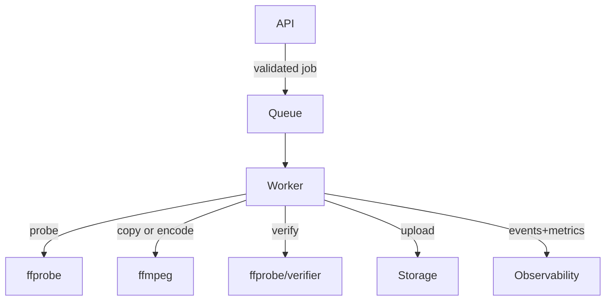

# Robustness & Bug Hardening Design

artifact_id: 9f4e9e9d-d2c2-4f3d-91d2-7f4b7a787b2c

## Overview

This design strengthens validation, execution guardrails, and post-process verification to reduce edge-case failures (e.g., zero-duration, invalid outputs). It integrates with existing modules under `src/ffmpeg`, `src/common`, `src/data`, and the worker in `src/worker`.

## Architecture



Key additions:

-   Pre-flight time validation and optional coercion
-   Source probe layer (ffprobe) with minimal fields
-   Copy-mode eligibility check (keyframe-aware, optional)
-   Output verification step gating upload
-   Retry classifier
-   Consistent cleanup semantics

## Components & Interfaces

### Validation

-   Location: `src/api` request validators (zod) and `src/ffmpeg/clipper.ts` runtime guards
-   Contract:
    -   Input: { start: number, end: number }
    -   Output: { startSec: number, endSec: number, durationSec: number }
    -   Errors: VALIDATION_FAILED, DURATION_TOO_LONG

### Probe

```ts
export interface SourceProbe {
    container: string | null;
    durationSec: number | null;
    video: { codec: string; width?: number; height?: number } | null;
    audio: { codec: string; channels?: number; sampleRate?: number } | null;
}

export interface Prober {
    probe(inputPath: string, timeoutMs?: number): Promise<SourceProbe>;
}
```

-   Implementation: thin wrapper around `ffprobe -v error -show_streams -show_format -print_format json`
-   Error mapping: SOURCE_UNREADABLE on parse/timeout

### Copy Eligibility

```ts
export interface CopyDecisionInput {
    startSec: number;
    requireKeyframe: boolean;
    keyframeProximitySec: number; // default 0.5
}
export function shouldAttemptCopy(
    i: CopyDecisionInput,
    probe: SourceProbe
): boolean;
```

-   Optional pre-check: `ffprobe -skip_frame nokey -select_streams v:0 -show_frames -read_intervals %+#2`
-   If not implementable cheaply, feature flag off by default

### Output Verification

```ts
export interface VerifyOutputOptions {
    expectDurationSec: number;
    toleranceSec: number; // default 0.5
    requireFastStart: boolean; // mp4
    requireVideoOrAudio: 'video' | 'audio' | 'either';
    allowedVideoCodecs: string[]; // ["h264"] for fallback
    allowedAudioCodecs: string[]; // ["aac"] for fallback
}

export interface OutputVerifier {
    verify(
        path: string,
        opts: VerifyOutputOptions
    ): Promise<{ ok: true } | { ok: false; reason: string }>;
}
```

-   Implementation: use `ffprobe` JSON; check `format.tags.major_brand`/moov via `-v quiet -print_format json -show_format -show_streams`; optionally run `qtfaststart`-style header scan (best-effort)
-   On failure: delete file and return OUTPUT_VERIFICATION_FAILED

### Retry Classification

```ts
export type RetryClass = 'retryable' | 'non_retryable';
export function classifyError(e: unknown): RetryClass;
```

-   Heuristics: errno (EPIPE, ECONNRESET), transient storage (HTTP 5xx), ffmpeg exit codes coupled with stderr patterns (e.g., `Connection reset by peer`)

### Cleanup API

```ts
export interface Cleanup {
    removeScratch(dir: string): Promise<void>;
    removePartialStorage(keys: string[]): Promise<void>;
}
```

-   Ensure idempotent and guarded by KEEP_FAILED

## Data Model

No schema changes required for core hardening. Optional: add `probe_json` and `verify_json` columns for diagnostics (future).

## Error Handling

-   Use ServiceResult style: `Ok<T>` or `Err<ServiceError>`
-   ServiceError codes introduced/standardized:
    -   VALIDATION_FAILED
    -   DURATION_TOO_LONG
    -   SOURCE_UNREADABLE
    -   FFMPEG_COPY_FAILED
    -   FFMPEG_REENCODE_FAILED
    -   OUTPUT_VERIFICATION_FAILED
    -   RETRY_EXHAUSTED

## Configuration

-   MIN_DURATION_SEC (default 0.5)
-   COERCE_MIN_DURATION (default false)
-   MAX_CLIP_DURATION_SEC (default 3600)
-   REQUIRE_KEYFRAME_FOR_COPY (default false)
-   KEYFRAME_PROXIMITY_SEC (default 0.5)
-   VERIFY_TOLERANCE_SEC (default 0.5)
-   VERIFY_REQUIRE_FASTSTART (default true)
-   VERIFY_EXPECT_STREAM: video|audio|either (default either)
-   ALLOWED_VIDEO_CODECS (default ["h264"]) for fallback outputs
-   ALLOWED_AUDIO_CODECS (default ["aac"]) for fallback outputs
-   MAX_RETRIES (default 3), INITIAL_BACKOFF_MS (default 500)
-   KEEP_FAILED (default 0)

## Testing Strategy

-   Unit tests:
    -   Time validation and coercion paths (near-zero, too long)
    -   Progress monotonicity and 99% cap until exit
    -   Output verifier with synthetic ffprobe JSON fixtures
    -   Retry classifier mapping
-   Integration tests:
    -   Zero and near-zero durations → immediate 100% event
    -   Copy failure → fallback encode succeeds
    -   Bad output (truncated file) → verification fails and cleans up
-   End-to-end:
    -   Full pipeline with small sample and env flags toggled

## Performance Considerations

-   Probe and verify are single `ffprobe` calls; keep timeouts small (e.g., 3s) and reuse process spawning utilities.
-   Avoid double-reading large files; rely on metadata only.

## Rollout

1. Implement verifier and unit tests
2. Wire verifier after both copy and re-encode
3. Add probe and decision guardrails (feature-flagged)
4. Add validation/coercion switches
5. Rollout with metrics dashboards for verify.failed{kind}
