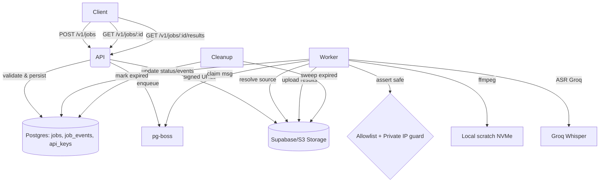

# Design

artifact_id: be8f9b5e-2a0a-416a-aa62-224390e950a1

## Overview

A Bun + Elysia REST service orchestrates clip jobs backed by Postgres (Drizzle) and a pg-boss queue. Workers resolve media from either uploads (Supabase storage) or YouTube (yt-dlp, feature-flagged), perform fast-path stream-copy clipping when possible, fall back to re-encode for precision, optionally run ASR via Groq Whisper to produce SRT, optionally burn-in subtitles, then store outputs to results bucket and return signed URLs. Observability includes JSON logs, metrics, and a cleanup sweeper for expired artifacts.

## Architecture

### High-level flow



### Core components

-   API Service (Elysia): endpoints, validation (zod), auth (API keys), health/metrics, optional OpenAPI.
-   Data layer (Drizzle): jobs, job_events, api_keys repositories.
-   Queue adapter: PgBossQueueAdapter with publish/start/subscribe.
-   Worker: consumes queue messages; performs resolve->clip->subs->store; updates status.
-   Storage repo: Supabase client for signed URLs; buckets for sources/results.
-   Media IO resolvers: upload resolver (signed URLs, fetch to scratch, ffprobe), youtube resolver (yt-dlp with allowlist/DNS safety, feature flag).
-   Cleanup: sweeper that deletes expired artifacts from storage and marks rows.
-   Metrics & logging: interfaces provided in src/common.

## Data model (Drizzle / Postgres)

TypeScript types (subset):

```ts
export type JobStatus = 'queued' | 'processing' | 'done' | 'failed';

interface JobRecord {
    id: string;
    sourceType: 'upload' | 'youtube';
    sourceKey?: string; // for upload
    sourceUrl?: string; // for youtube
    startTc: string; // HH:MM:SS(.ms)
    endTc: string; // HH:MM:SS(.ms)
    subtitleLang?: 'auto' | string;
    burnIn?: boolean;
    resultVideoKey?: string;
    resultSrtKey?: string;
    status: JobStatus;
    createdAt: string;
    updatedAt: string;
    expiresAt?: string;
}
```

Drizzle schema (conceptual):

```ts
// enums
declare const jobStatus: 'job_status';

table jobs {
  id uuid pk,
  source_type source_type not null,
  source_key text null,
  source_url text null,
  start_tc text not null,
  end_tc text not null,
  subtitle_lang text null,
  burn_in boolean not null default false,
  result_video_key text null,
  result_srt_key text null,
  status job_status not null default 'queued',
  created_at timestamptz not null default now(),
  updated_at timestamptz not null default now(),
  expires_at timestamptz null
  -- indexes: (status, created_at), expires_at
}

table job_events {
  job_id uuid fk jobs(id) on delete cascade,
  ts timestamptz not null default now(),
  type text not null,     // e.g., 'enqueued','processing','progress','done','failed'
  data jsonb null,
  primary key (job_id, ts)
}

table api_keys {
  id uuid pk,
  name text null,
  secret_hash text not null,
  last_used_at timestamptz null
}
```

## API design (REST)

-   POST /v1/jobs
    -   Auth: Bearer ck*<id>*<secret>
    -   Body: CreateJobInput
    -   202 { id, status }
-   GET /v1/jobs/:id
    -   200 JobRecord + recent events
-   GET /v1/jobs/:id/results
    -   200 { videoUrl, srtUrl? }
    -   409 if not done; 410 if gone
-   POST /v1/uploads/sign
    -   200 { url, method, headers, sourceKey }
-   GET /health
-   GET /metrics
-   GET /openapi.json (flagged)

### Validation & contracts

Use src/contracts/schemas.ts with zod for request/response. Ensure timecode parsing (src/common/time.ts) and state machine (src/common/state.ts) are correct and covered by tests.

## Worker pipeline

1. Resolve source

-   upload: build signed download URL for sourceKey; fetch to scratch; ffprobe for duration/container; enforce caps.
-   youtube: if ENABLE_YTDLP=true and host allowlisted, run yt-dlp to scratch; ffprobe; enforce caps; DNS guard rejects private IPs.

2. Clip

-   Prefer stream-copy: `ffmpeg -ss <start> -to <end> -i input -c copy` when keyframes permit; else precise re-encode with `-preset veryfast -crf 22 -c:v libx264 -c:a aac`.
-   Validate duration tolerance.

3. Subtitles (optional)

-   If subtitleLang provided:
    -   auto: call Groq Whisper API with audio track; save SRT
    -   specific code: passthrough or use model if supported
-   If burnIn=true: render SRT as burned-in variant using `subtitles` filter; else return SRT URL.

4. Store results

-   Upload MP4 (and SRT if present) to results bucket under job-specific prefix; set expiresAt.

5. Update status/events

-   transitions: queued -> processing -> done | failed; retries idempotent with deterministic keys.

## Interfaces (TypeScript)

```ts
export interface QueueAdapter {
    start(): Promise<void>;
    shutdown(): Promise<void>;
    publish(
        msg: { jobId: string; priority?: 'fast' | 'normal' | 'bulk' },
        opts?: { timeoutSec?: number }
    ): Promise<void>;
    subscribe(
        handler: (msg: { jobId: string }) => Promise<void>
    ): Promise<void>;
}

export interface JobsRepository {
    create(
        row: Omit<JobRecord, 'createdAt' | 'updatedAt' | 'status'> &
            Partial<Pick<JobRecord, 'status'>>
    ): Promise<JobRecord>;
    get(id: string): Promise<JobRecord | null>;
    patch(id: string, patch: Partial<JobRecord>): Promise<JobRecord>;
}

export interface JobEventsRepository {
    add(evt: {
        jobId: string;
        type: string;
        data?: Record<string, unknown>;
    }): Promise<void>;
    list(
        jobId: string,
        limit?: number,
        offset?: number
    ): Promise<Array<{ ts: string; type: string; data?: any }>>;
}

export interface StorageRepo {
    signUpload(
        path: string,
        opts: { contentType?: string; expiresSec?: number }
    ): Promise<{
        url: string;
        method: 'PUT' | 'POST';
        headers?: Record<string, string>;
    }>;
    signDownload(
        path: string,
        opts: { expiresSec: number }
    ): Promise<{ url: string }>;
    put(
        path: string,
        data: Blob | ArrayBuffer | ReadableStream,
        opts?: { contentType?: string }
    ): Promise<void>;
    delete(path: string): Promise<void>;
}
```

## Error handling pattern

Use ServiceResult and ServiceError with envelopes. Map domain errors to HTTP:

-   400 VALIDATION_FAILED/BAD_REQUEST
-   401 UNAUTHORIZED
-   403 FORBIDDEN
-   404 NOT_FOUND
-   409 CONFLICT
-   410 GONE
-   429 RATE_LIMITED
-   5xx INTERNAL/UPSTREAM_FAILURE

Include correlationId from request header X-Request-Id or generated UUID. Ensure redactSecrets is applied to logs and error messages. Implement fromException to capture unknowns.

## Security and safety

-   API keys: ck*<uuid>*<secret>; hashed secret stored server-side; PRNG using Bun Crypto; token parsing/redaction utilities.
-   YouTube path: ENABLE_YTDLP gate; ALLOWLIST_HOSTS; DNS resolution with private IP rejection (IPv4 and IPv6 ranges).
-   Storage keys: never log raw URLs; redact query tokens.

## Cleanup strategy

-   Batch scan jobs with expiresAt <= now; for each, attempt storage delete of result\* keys, then mark rows as cleaned/expired.
-   Metrics: counts, durations, errors; rate limiting and backoff.

## Testing strategy

-   Unit tests: timecode parsing/formatting/range; state transitions; redaction; API key packing/unpacking; DNS guards.
-   Integration tests: JobsRepo and JobEventsRepo with a test DB; queue publish/consume; media-io resolvers with mocks.
-   E2E smoke: Create job -> worker processes -> results available; run in CI with tiny sample files.
-   Performance: benchmark ffmpeg stream-copy vs re-encode on sample media; assert SLOs for 10s clips in CI (time-bounded).

## Deployment

-   Single container for API; separate deployment for worker(s); share .env; run cleanup as a scheduled job.
-   Expose metrics endpoint for scraping. Provide minimal README and OpenAPI JSON.
