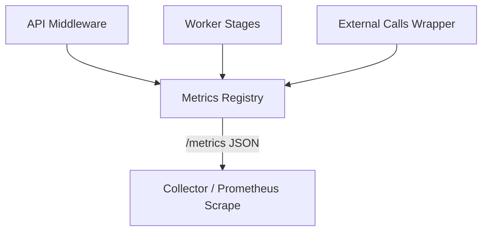

# Observability Improvements Design

artifact_id: 7d4b0e12-a6e4-4b2a-b4d2-6ed0e42f9d11

## Overview

Provide comprehensive insight into system behavior (API, worker, external dependencies) with low overhead. Phased approach: Core Metrics -> Stage Timings -> Tracing Hooks -> Alert SLOs.

## Architecture



### Components

-   MetricsRegistry: lightweight singleton with typed helpers (counter, histogram, gauge).
-   HttpMetricsMiddleware: wraps request lifecycle (start time, route normalization, error capture).
-   WorkerStageTimer: RAII helper to measure stage durations.
-   ExternalCallWrapper: generic timing wrapper for yt-dlp, ffprobe, storage, ASR provider.
-   ResourceSampler: periodic sampler updating process & disk gauges.
-   EventEmitter Integration: ensures job events cause metrics increments.
-   TracingAdapter: noop instrumentation interface (future OTel).

## Metric Catalog (Phase 1)

| Name                          | Type      | Labels                    | Description                        |
| ----------------------------- | --------- | ------------------------- | ---------------------------------- |
| http.requests_total           | counter   | method, route, code_class | Count of HTTP responses            |
| http.errors_total             | counter   | route, code               | Error responses (4xx/5xx)          |
| http.request_latency_ms       | histogram | route                     | End-to-end latency                 |
| jobs.created_total            | counter   | -                         | Jobs created                       |
| jobs.status_transition_total  | counter   | from,to                   | Status transitions                 |
| jobs.total_latency_ms         | histogram | -                         | Create -> terminal duration        |
| worker.stage_latency_ms       | histogram | stage                     | Stage durations                    |
| worker.stage_failures_total   | counter   | stage, code               | Stage failures                     |
| external.calls_total          | counter   | service,op,outcome        | External dependency calls          |
| external.call_latency_ms      | histogram | service,op                | Duration per external op           |
| worker.inflight_jobs          | gauge     | -                         | Active job count                   |
| proc.memory_rss_mb            | gauge     | -                         | Resident memory                    |
| proc.open_fds                 | gauge     | -                         | File descriptors (best effort)     |
| scratch.disk_used_pct         | gauge     | -                         | Scratch directory % usage          |
| event_loop.lag_ms             | histogram | -                         | Event loop lag (setInterval drift) |
| events.persist_failures_total | counter   | -                         | Job event DB write errors          |
| worker.recovered_jobs_total   | counter   | reason                    | Lease recovery events              |

## Implementation Details

### MetricsRegistry

```ts
interface Counter {
    inc(v?: number, labels?: LabelValues): void;
}
interface Histogram {
    observe(v: number, labels?: LabelValues): void;
}
interface Gauge {
    set(v: number, labels?: LabelValues): void;
}

class MetricsRegistry {
    private counters = new Map<string, Counter>();
    counter(name: string, opts?: { labelNames?: string[] }): Counter {
        /* create or reuse */
    }
    // similar for histogram/gauge
    snapshot(): Record<string, unknown> {
        /* flatten */
    }
}
```

Label cardinality control: route normalization (e.g., /api/jobs/:id). Deny counters with more than allowed label set (log once).

### HTTP Middleware

Wraps request; on begin capture start; on complete compute ms. Determine route template from router context (add mapping). Add correlationId propagation.

### WorkerStageTimer

```ts
async function withStage<T>(stage: string, fn: () => Promise<T>): Promise<T> {
    const start = performance.now();
    try {
        return await fn();
    } catch (e) {
        metrics
            .counter('worker.stage_failures_total', {
                labelNames: ['stage', 'code'],
            })
            .inc(1, { stage, code: errCode(e) });
        throw e;
    } finally {
        metrics
            .histogram('worker.stage_latency_ms', { labelNames: ['stage'] })
            .observe(performance.now() - start, { stage });
    }
}
```

### ExternalCallWrapper

Generic function adding timing + outcome classification (success, error, timeout).

### ResourceSampler

Interval collects: process.rss, event loop lag (setImmediate vs Date diff), scratch disk usage via fs.statvfs (if available; fallback manual). Updates gauges.

### /metrics Endpoint

Returns JSON snapshot, plus queue metrics merged. Example:

```json
{
    "timestamp": "ISO",
    "counters": {
        "http.requests_total|method=GET,route=/api/jobs,code_class=2xx": 123
    },
    "gauges": { "proc.memory_rss_mb": 128.5 },
    "histograms": {
        "http.request_latency_ms": {
            "count": 120,
            "sum": 5321,
            "buckets": { "50": 12, "90": 40, "99": 80 }
        }
    }
}
```

Histogram export: compute quantiles on-demand from internal reservoir (CKMS or simple fixed bucket). Simpler: fixed bucket boundaries array and counts per bucket.

## Tracing Hooks (Phase 3)

Define interface:

```ts
interface Tracer {
    startSpan(name: string, attrs?: Record<string, any>): Span;
}
interface Span {
    end(err?: Error): void;
}
export const tracer: Tracer = new NoopTracer();
```

Later swapped with real OTel tracer.

## Error Handling

Metrics operations MUST NOT throw. Wrap in try/catch; on failure log once per name (circuit suppression).

## Testing Strategy

-   Unit: registry creation, label duplication prevention, histogram bucket aggregation.
-   Integration: HTTP middleware increments metrics; worker stage wrapper records durations; external call wrapper classification.
-   Load test script verifying overhead <5% (baseline vs instrumented).

## Security Considerations

-   Redact signed URLs before labeling.
-   Ensure no raw API keys in metrics (never put tokens in labels).

## Rollout Phases

1. Core registry + HTTP + job lifecycle
2. Worker stage + external wrappers
3. Resource sampler + recovery metrics
4. Tracing hooks + SSE event metrics

## Open Questions

-   Do we need Prometheus exposition format soon? (Defer until multi-instance scaling).
-   Use quantile algorithm vs fixed buckets? (Start with fixed buckets.)
