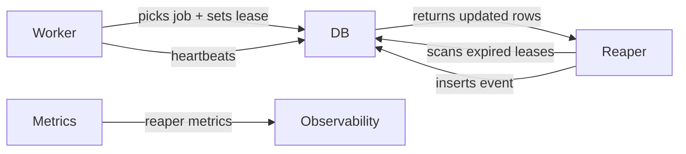

# design.md

artifact_id: 8b6a9f32-2d4a-4d66-9f05-3f6e2b0a7f39

## Overview

Implement a reaper service that scans job tables (`jobs`, `asr_jobs`) for expired leases and either requeues or fails jobs depending on attempts. Use leases + heartbeats to avoid killing healthy long-running work. Run as a small Bun service in-app or as a scheduled DB job.

## Architecture

Mermaid diagram (conceptual):



Core components:

-   Job schema changes (DB)
-   Worker lease + heartbeat logic (workers which already exist under `worker/`)
-   Reaper service (`scripts/reaper.ts`) that runs periodically and updates rows
-   Event logging (`job_events` table) and metrics emission

## Interfaces

TypeScript interfaces used by workers/reaper:

```ts
export type JobTable = 'jobs' | 'asr_jobs';

export interface ReaperResult {
    requeuedIds: string[];
    failedIds: string[];
}
```

Worker functions:

```ts
async function claimJob(id: string, workerId: string, leaseSec: number) {
    /* ... */
}
async function heartbeatJob(id: string, workerId: string, leaseSec: number) {
    /* ... */
}
async function finishJob(
    id: string,
    success: boolean,
    details?: { code?: string; reason?: string }
) {
    /* ... */
}
```

## Data models / Schema changes

Add nullable fields to `jobs` and `asr_jobs` (aligning with existing repo naming):

-   locked_by TEXT NULL
-   lease_expires_at TIMESTAMPTZ NULL
-   last_heartbeat_at TIMESTAMPTZ NULL -- existing migration uses this name
-   attempt_count INT NOT NULL DEFAULT 0 -- existing migration uses this name
-   max_attempts INT NOT NULL DEFAULT 3
-   fail_code TEXT NULL
-   fail_reason TEXT NULL
-   stage TEXT NULL
-   next_earliest_run_at TIMESTAMPTZ NULL
-   expected_duration_ms INT NULL

Indexes:

```sql
-- jobs already has idx on (status, last_heartbeat_at); add lease index
CREATE INDEX IF NOT EXISTS idx_jobs_status_lease ON jobs (status, lease_expires_at);
CREATE INDEX IF NOT EXISTS idx_asr_jobs_status_lease ON asr_jobs (status, lease_expires_at);
```

Events: reuse existing `job_events(job_id, data)` table. Store structured JSON in `data`, e.g.:

```json
{
    "type": "reaper:requeued", // or reaper:failed(timeout)
    "table": "jobs",
    "details": { "reason": "lease_expired", "locked_by": "worker-1" },
    "at": "2025-08-15T12:34:56Z"
}
```

## Reaper algorithm

-   Every REAPER_INTERVAL_SEC (default 60s) run:
    -   For each table in ["jobs","asr_jobs"]:
        -   1. Requeue where status = 'processing' AND lease_expires_at < NOW() AND attempt_count < max_attempts AND (next_earliest_run_at IS NULL OR next_earliest_run_at <= NOW()). Use a single UPDATE ... RETURNING to get ids.
        -   2. Fail where status = 'processing' AND lease_expires_at < NOW() AND attempt_count >= max_attempts. UPDATE ... RETURNING ids.
        -   For each updated id, insert a row in `job_events` (JSON `data`) and emit metrics.

Use transactions and `FOR UPDATE SKIP LOCKED` if scanning large sets.

## Error handling

Use a ServiceResult pattern:

```ts
type ServiceResult<T> =
    | { ok: true; value: T }
    | { ok: false; error: string; code?: string };
```

Reaper should retry transient DB errors with a small backoff. If reaper fails, log and continue next interval.

## Testing

-   Unit tests for lease expiry logic and backoff calculation.
-   Integration tests that:
    -   Insert a job with lease_expires_at in the past and attempts < max -> reaper requeues.
    -   Insert a job with lease_expires_at in the past and attempts >= max -> reaper fails and emits event.
    -   Ensure next_earliest_run_at backoff is respected.

## Deployment

Add script in package.json: `start:reaper`.
Run under PM2/systemd in production as a singleton service.
If pg-boss is the ground truth for dispatch, requeue by updating the DB row (status='queued', next_earliest_run_at) and let your dispatcher re-enqueue; or optionally republish via the existing queue adapter if applicable.

## Environment variables

-   REAPER_INTERVAL_SEC=60
-   JOB_MAX_ATTEMPTS=3 # honored per-row max_attempts overrides when present
-   DEFAULT_LEASE_SEC=300
-   CLIP_SLA_FACTOR=6
-   ASR_SLA_FACTOR=12
-   BURNIN_SLA_FACTOR=8
-   HEARTBEAT_SEC=15

Compatibility with existing envs:

-   Prefer existing queue/envs when present: `QUEUE_MAX_ATTEMPTS`, `QUEUE_VISIBILITY_SEC`, `QUEUE_RETRY_BACKOFF_MS_BASE`, `QUEUE_RETRY_BACKOFF_MS_MAX`. Use them as defaults and allow JOB\_\* to override where specified.

## Observability

Emit metrics: `reaper.requeues`, `reaper.failures`, `reaper.scan_duration_ms` and attach tags `table`, `stage`.

Log structured events for every action.
