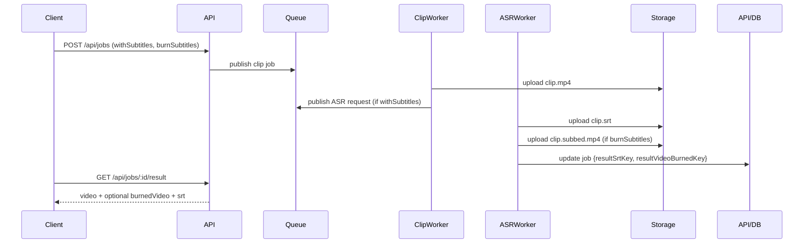

# design.md

## Overview

We add a first-class, optional subtitle burn-in path that kicks in after ASR. The API already supports withSubtitles and burnSubtitles flags and persistence fields (resultSrtKey, resultVideoKey). We will:

-   Formalize burn-in in the ASR worker using ffmpeg's subtitles filter.
-   Store the burned variant at `results/{jobId}/clip.subbed.mp4` without overwriting the original.
-   Expose both original and burned URLs in the result API (non-breaking with new optional field).
-   Add metrics and events for visibility.

Assumptions:

-   Tech stack: Bun + TypeScript, ffmpeg present in PATH on workers.
-   Storage: Supabase bucket via existing StorageRepo.
-   DB schema already includes with_subtitles, burn_subtitles, result_srt_key.

## Architecture

Flow:

1. Client creates job with withSubtitles=true [and optionally burnSubtitles=true].
2. Clip worker produces results/{jobId}/clip.mp4 and marks job done.
3. ASR worker consumes ASR queue for the job and generates SRT.
4. If burnSubtitles=true, ASR worker runs ffmpeg burn-in on the finished MP4, uploads `clip.subbed.mp4` and updates job to reference burned key (new field) and/or publish an event.
5. API result endpoint signs and returns URLs.



## Components and Interfaces

New/updated data types (TypeScript):

```ts
// contracts/types.ts (additive, non-breaking)
export interface JobResult {
    id: string;
    video: { key: string; url: string };
    burnedVideo?: { key: string; url: string }; // NEW optional
    srt?: { key: string; url: string };
}

export interface JobRow {
    // ...existing
    resultVideoKey?: string | null;
    resultSrtKey?: string | null;
    resultVideoBurnedKey?: string | null; // NEW optional
}
```

Worker burn-in contract:

```ts
interface BurnInRequest {
    srcVideoPath: string;
    srtPath: string;
    outPath: string; // local temp path
    style?: {
        font?: string; // e.g., DejaVuSans
        fontSize?: number; // px
        primaryColor?: string; // ASS BGR hex
        outline?: number;
        shadow?: number;
        marginV?: number; // vertical margin
    };
}

type BurnInResult =
    | { ok: true }
    | { ok: false; code?: number; stderr?: string };
```

## Burn-in implementation details

-   Use filter: `-vf subtitles=<escapedSrt>:force_style='FontSize=18,Outline=1,Shadow=0,MarginV=20'`
-   Always re-encode the video for burn-in. Use same fallback encoder settings as clip fallback: `-c:v libx264 -preset veryfast -pix_fmt yuv420p -c:a copy` to save audio time.
-   Escape paths: replace `'` with `\'` and spaces via proper quoting to avoid filtergraph injection.
-   If SRT contains non-UTF8, transcode text to UTF-8 before write (the ASR-generated SRT is UTF-8 already).

Pseudo-code:

```ts
function escapeForSubtitlesFilter(path: string): string {
    // Escape backslashes and colons for Windows paths if ever used; basic Unix:
    return path
        .replace(/\\/g, '\\\\')
        .replace(/:/g, '\\:')
        .replace(/'/g, "\\'")
        .replace(/,/g, '\\,');
}

async function burnIn(req: BurnInRequest): Promise<BurnInResult> {
    const srt = escapeForSubtitlesFilter(req.srtPath);
    const args = [
        '-y',
        '-i',
        req.srcVideoPath,
        '-vf',
        `subtitles=${srt}:force_style='FontSize=${
            req.style?.fontSize ?? 18
        },Outline=${req.style?.outline ?? 1},Shadow=${
            req.style?.shadow ?? 0
        },MarginV=${req.style?.marginV ?? 18}'`,
        '-c:v',
        'libx264',
        '-preset',
        'veryfast',
        '-pix_fmt',
        'yuv420p',
        '-c:a',
        'copy',
        req.outPath,
    ];
    const proc = Bun.spawn(['ffmpeg', ...args], { stderr: 'pipe' });
    const code = await proc.exited;
    if (code === 0) return { ok: true };
    let stderr = '';
    if (proc.stderr)
        for await (const c of proc.stderr)
            stderr += new TextDecoder().decode(c);
    return { ok: false, code, stderr };
}
```

## Data Model

-   Storage keys already exist: `resultVideo`, `resultVideoBurned`, `resultSrt`.
-   DB: add optional `result_video_burned_key` to jobs table to keep both assets. If not adding a new column, we can continue to overwrite resultVideoKey with burned key, but recommended is to add a separate column for clarity.

PostgreSQL (drizzle):

```ts
// schema.ts
resultVideoBurnedKey: text('result_video_burned_key'),
```

Migration SQL:

```sql
ALTER TABLE jobs ADD COLUMN IF NOT EXISTS result_video_burned_key text;
```

Repo mapping updates will pass-through the field.

## API changes

-   POST /api/jobs: validation to ensure burnSubtitles implies withSubtitles; if burnSubtitles=true and withSubtitles=false, coerce or reject with 400.
-   GET /api/jobs/:id: include `resultVideoBurnedKey` when present.
-   GET /api/jobs/:id/result: sign and include `burnedVideo` when present; continue to return `video` for original clip.

Backwards compatibility: All additions are optional fields.

## Error handling

-   ASR or burn-in failure is non-fatal to the main clip. Record job event entries; do not flip job status to failed.
-   Use ServiceResult-like pattern when possible; ensure logs capture ffmpeg stderr snippet.
-   If burn-in fails, keep SRT available for client-side soft subtitles.

## Testing strategy

-   Unit: escapeForSubtitlesFilter, API validators, repo mapping for new field.
-   Integration: generate 2-second sample video, create job with withSubtitles+burnSubtitles, simulate ASR with tiny SRT (or run actual Groq provider behind env flag), run burn-in, assert burned asset exists and is signed by API.
-   E2E (optional): Run full queue processing with Bun worker in CI when ffmpeg present; otherwise skip.

## Observability

-   Metrics: `burnin.started`, `burnin.completed`, `burnin.failed`, `burnin.duration_ms`.
-   Events: `asr:started`, `asr:completed`, `burnin:started`, `burnin:completed`, `burnin:failed` appended to `job_events`.

## Limits and performance

-   CPU-bound. Consider optional GPU acceleration later (NVENC/VAAPI). For now, `veryfast` preset keeps latency reasonable.
-   For long clips, burn-in can take time. We keep main job done and make burned asset additive.
