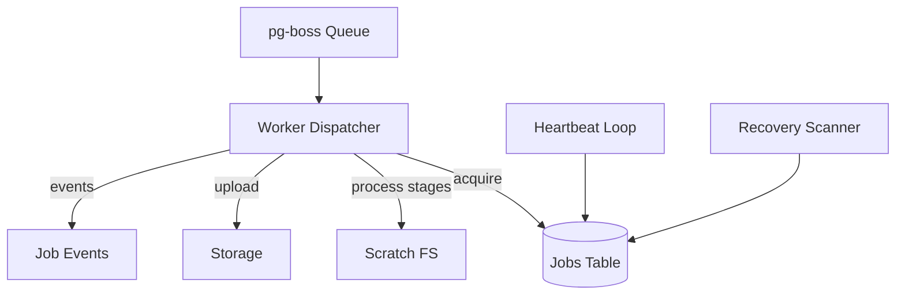

# Worker Runtime Resilience Design

artifact_id: d4f71dcb-3d05-4d61-9bf0-0f6f2d4826a4

## Overview

Implement reliable processing through heartbeats, lease recovery, idempotent artifact generation, concurrency management, graceful shutdown, and retry classification. Target minimal coupling to queue implementation (pg-boss) while using Postgres for authoritative job state.

## Architecture



## Data Model Changes

```sql
ALTER TABLE jobs ADD COLUMN last_heartbeat_at timestamptz;
ALTER TABLE jobs ADD COLUMN attempt_count int NOT NULL DEFAULT 0;
ALTER TABLE jobs ADD COLUMN processing_started_at timestamptz;
```

(If columns already exist, ensure indexes: CREATE INDEX ON jobs (status, last_heartbeat_at);
)

## Job Acquisition

Atomic transition SQL (if not relying solely on pg-boss):

```sql
UPDATE jobs SET status='processing', processing_started_at=now(), last_heartbeat_at=now()
WHERE id=$1 AND status='queued'
RETURNING id;
```

If rowCount=0 -> someone else acquired.

## Heartbeat

Loop every HEARTBEAT_INTERVAL_SEC:

```sql
UPDATE jobs SET last_heartbeat_at=now() WHERE id IN ($activeIds);
```

Batch update for all active jobs. On failure log once and backoff.

## Recovery Scanner

Interval RECOVERY_SCAN_INTERVAL_SEC executes:

```sql
UPDATE jobs SET status='queued', attempt_count=attempt_count+1
WHERE status='processing'
  AND now()-last_heartbeat_at > (LEASE_TIMEOUT_SEC || ' seconds')::interval
  AND attempt_count < MAX_ATTEMPTS
RETURNING id, attempt_count;
```

Emit job_events row `requeued:stale` for each.
If attempt_count hits MAX_ATTEMPTS -> mark failed with code RETRIES_EXHAUSTED.

## Stage Execution Wrapper

Use withStage() (see observability) to wrap phases: resolve, clip, upload, asr, finalize.
Errors bubble to classify & decide retry.

## Retry Classification

```ts
function classify(err: Error): 'retryable' | 'fatal' {
    if (
        ServiceError &&
        code in
            [
                'STORAGE_UPLOAD_FAILED',
                'YTDLP_TIMEOUT',
                'CLIP_TIMEOUT',
                'UPSTREAM_FAILURE',
                'INTERNAL_TRANSIENT',
            ]
    )
        return 'retryable';
    return 'fatal';
}
```

Fatal -> status=failed immediately. Retryable -> if attempt_count+1 < MAX_ATTEMPTS set queued.

## Idempotent Output

-   Temp file: `${SCRATCH_DIR}/jobs/<jobId>/<jobId>-work.mp4`.
-   After successful clip, fs.rename to `<jobId>-final.mp4` then upload.
-   Before processing check storage/head if result already exists (optional HEAD) -> if exists + integrity ok -> emit uploaded + done without re-clipping.

## Concurrency Control

Semaphore limiting number of active jobs to MAX_CONCURRENCY. Acquire before dequeue; release after terminal stage.
Queue prefetch: fetch up to MAX_CONCURRENCY - active.

## Progress Emission

Ffmpeg progress parser triggers event emission throttled by delta≥1 or 500ms. Maintain lastPct map per job.

## Graceful Shutdown

On SIGTERM:

1. Set shuttingDown flag.
2. Stop pulling new messages.
3. Wait for active jobs with Promise.race(cancelAfterTimeout, allJobsDone).
4. Jobs still active after timeout: record event aborted:shutdown (no status change) rely on recovery.

## Metrics

-   worker.heartbeats_total (increment per batch update)
-   worker.heartbeat_failures_total
-   worker.recovered_jobs_total{reason='stale'}
-   worker.retry_attempts_total{code}
-   worker.concurrent_jobs gauge
-   worker.acquire_conflicts_total (failed UPDATE due to another worker)

## Testing Plan

-   Unit: classify retryable/fatal mapping.
-   Integration: simulate crash (kill process) mid-job -> restart -> recovery scanner picks up.
-   Concurrency: run >MAX_CONCURRENCY inflight requests -> ensure cap.
-   Idempotency: rerun job with existing final artifact -> skip processing.
-   Graceful shutdown: send SIGTERM -> ensure no new jobs started and active job completes.

## Failure Scenarios & Handling

| Scenario                        | Handling                                      |
| ------------------------------- | --------------------------------------------- |
| Worker crash                    | Recovery scanner requeues after lease timeout |
| Upload transient error          | Retry attempt until MAX_ATTEMPTS              |
| Ffmpeg hard failure             | Mark failed (fatal)                           |
| Data corruption (0-byte output) | Treat as retryable (requeue)                  |
| Duplicate queue delivery        | Acquire logic prevents double processing      |

## Security Considerations

-   Scratch directories isolated per job (no shared path traversal).
-   On failure, logs do not expose file paths outside scratch root.

## Rollout

1. Add columns + migration.
2. Implement heartbeat batch update
3. Implement recovery scanner
4. Add retry classification & attempt counting
5. Add concurrency semaphore
6. Add graceful shutdown hook
7. Add idempotent artifact check

## Open Questions

-   Should lease timeout adjust dynamically based on clip duration? (Future enhancement.)
-   Include jitter in recovery scan interval? (Yes small ±10% to avoid thundering herd.)
